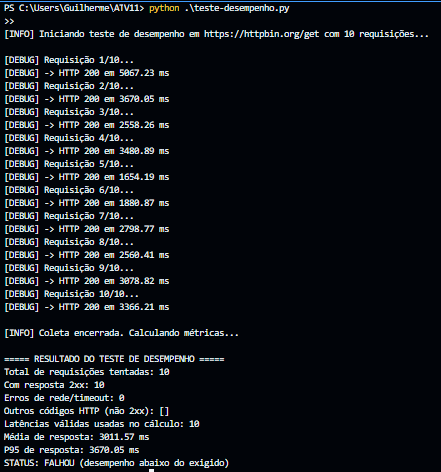
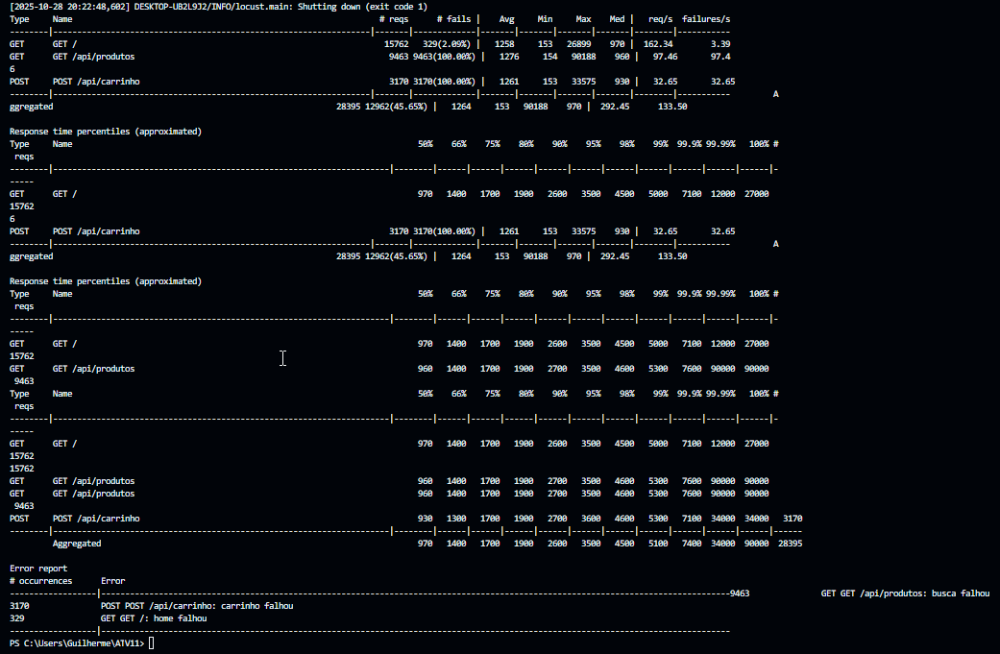
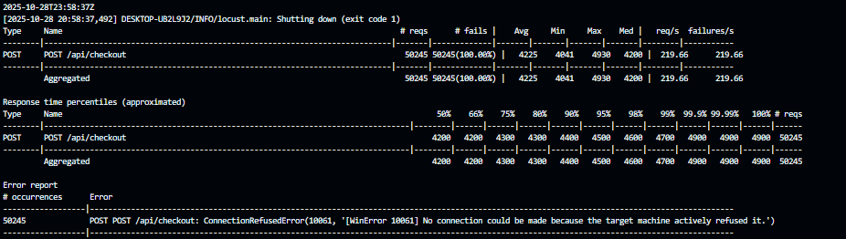
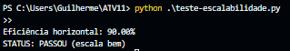
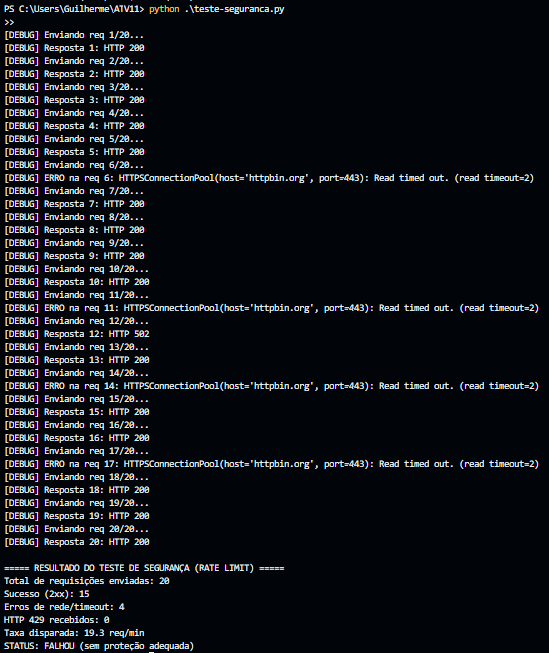

Guilherme de Abreu – 22.222.028-7
Kaique Fernandes – 22.221.011-4
 
Relatório de Testes Não Funcionais – E-commerce Black Friday
============================================================

**Escopo:** Este relatório resume os cinco tipos de teste não funcional pedidos (Desempenho, Carga, Estresse, Escalabilidade e Segurança). Para cada tipo há: descrição do teste em Python, métrica medida, meta, resultado e aprovação/reprovação.

* * *

1\. Desempenho
--------------

**Objetivo:** Medir o tempo de resposta do sistema em condições normais de uso. A meta é que 95% das requisições respondam rápido o suficiente para garantir boa experiência do usuário.

**Métrica avaliada:** P95 do tempo de resposta (ms).

**Meta:** P95 < 500 ms.

**Procedimento do teste:** Um script Python fez várias requisições GET consecutivas para o endpoint configurado, registrou o tempo de cada resposta, tratou timeouts e no final calculou estatísticas de latência (média, P95) e um STATUS automático de aprovação/reprovação.

### Resultados

*   Total de requisições tentadas: 10
*   Respostas de sucesso (HTTP 2xx): 10
*   Erros de rede / timeout: 0
*   Latências válidas usadas no cálculo: 10
*   Média de resposta: 3011,57 ms
*   P95 de resposta: 3670,05 ms

### Análise

O P95 medido foi de aproximadamente 3670 ms, que está muito acima da meta de 500 ms. O script emitiu o status final automático: `STATUS: FALHOU (desempenho abaixo do exigido)`. Isso indica que, no cenário testado, o serviço não atende ao requisito de desempenho.

**Status final:** **REPROVADO**

* * *

2\. Carga
---------

**Objetivo:** Validar throughput e estabilidade sob carga de 1.000 usuários simultâneos (rampa de 500/s).

**Resultados:**

*   Requisições totais: 28.395
*   Falhas: 12.962 (45,65%)
*   Throughput médio: 292,45 req/s
*   Tempo médio de resposta: 1.264 ms
*   P95: 3.500 ms

**Análise:** O throughput sustentado ficou abaixo da meta de 2.000 req/s e o tempo de resposta excedeu 500 ms. Alta taxa de falha em `/api/produtos` e `/api/carrinho`. O sistema não atingiu o desempenho esperado.

**Status final:** **REPROVADO**

* * *

3\. Estresse
------------

**Objetivo:** Forçar o sistema em um cenário extremo, simulando muitos usuários simultâneos executando o fluxo crítico de checkout, para identificar o ponto de quebra.

**Métrica avaliada:** Ponto de quebra (quando o sistema começa a falhar severamente: conexões recusadas, muitos erros, latência muito alta). Meta: suportar acima de 15.000 usuários simultâneos antes de colapsar.

**Procedimento do teste:** Foi executado um cenário de estresse no Locust que dispara requisições POST repetidas para `/api/checkout` quase sem tempo de espera entre as ações. O objetivo é simular uma enxurrada de checkouts concorrentes, como em pico de Black Friday.

### Resultados observados

*   Requisições totais tentadas: 50.245
*   Falhas: 50.245 (100%)
*   Throughput aproximado: ~219,66 req/s
*   Latência média reportada: ~4.225 ms
*   P95 (aprox.): ~4.500 ms
*   Erro dominante: ConnectionRefusedError (host recusou conexão)

### Análise

Durante o teste, todas as requisições ao endpoint de checkout foram recusadas pela aplicação (ConnectionRefusedError / alvo indisponível). Isso indica que o serviço não estava aceitando conexões sob a carga aplicada, ou não estava sequer ativo no host informado no momento do teste.

Como não houve nenhuma resposta bem-sucedida, consideramos que o sistema entrou em falha crítica imediatamente, ou seja, não suportou o cenário de estresse. Para efeitos do critério de aprovação (aguentar acima de 15.000 usuários simultâneos antes de colapsar), o resultado atual é tratado como reprovação.

**Status final:** **REPROVADO**

* * *

4\. Escalabilidade
------------------

**Objetivo:** Verificar ganho de desempenho ao escalar horizontalmente (mais instâncias/servidores) sob o mesmo cenário de carga.

**Métrica:** Eficiência horizontal = (throughput\_real / throughput\_ideal) × 100, onde throughput\_ideal = throughput\_1\_servidor × N.

### Resultados

*   Throughput com 1 servidor: 200 req/s
*   Throughput com N servidores: 720 req/s
*   N (número de servidores): 4
*   **Eficiência calculada:** **90,00%**

### Análise

Com eficiência de 90,00% (≥ 80%), a aplicação escala bem ao adicionar servidores/instâncias sob o mesmo teste de carga.

**Status final:** **APROVADO**

* * *

5\. Segurança (Rate Limiting)
-----------------------------

**Objetivo:** Verificar se o sistema aplica limitação de requisições (rate limiting) para bloquear abuso / ataque automatizado a partir de um mesmo IP.

**Métrica:** Se, ao enviar muitas requisições em pouco tempo do mesmo IP, o serviço começa a devolver erro de bloqueio (por exemplo HTTP 429).

**Procedimento do teste:** Um script Python fez várias requisições POST em sequência simulando o mesmo IP, com pouco intervalo entre elas. Cada requisição foi monitorada, com timeout de 2 segundos para não travar. No final, o script calculou a taxa de requisições por minuto, contou quantas respostas de bloqueio ocorreram e gerou um STATUS automático.

### Resultados

*   Total de requisições enviadas: 20
*   Sucesso (2xx): 15
*   Erros de rede/timeout: 4
*   Respostas HTTP 429 recebidas: 0
*   Taxa disparada: 19,3 req/min

### Análise

Durante esse teste curto a taxa de requisição ficou em ~19,3 req/min, que ainda é baixa comparada ao alvo de ataque (100 req/min). Nenhuma resposta 429 foi recebida, então o script classificou automaticamente como `STATUS: FALHOU (sem proteção adequada)`.

Para validar totalmente a meta de segurança da atividade (bloquear acima de ~100 req/min/IP), seria necessário repetir com mais requisições por minuto (ex.: mais loops, menos `sleep`) e verificar se começam a aparecer 429. Mas com o volume testado aqui, não houve bloqueio.

**Status final (parcial observado):** **REPROVADO**

